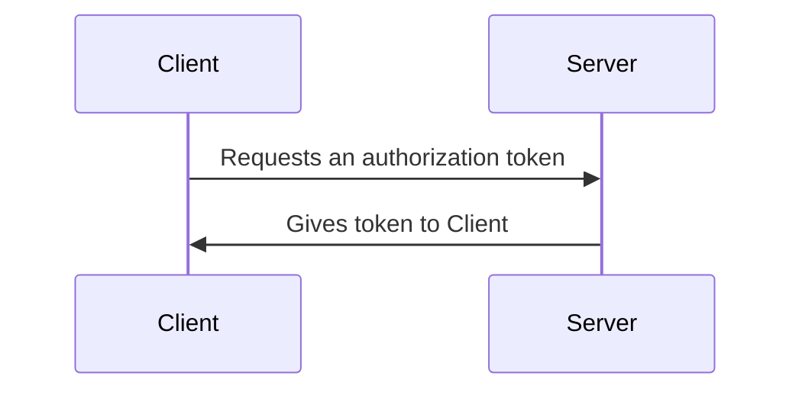
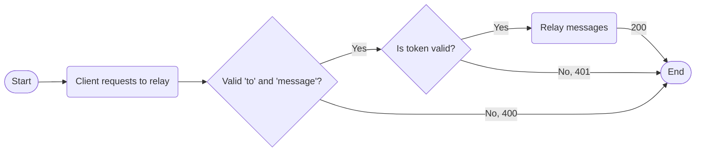

# Authentication with the Iris API

> [!WARNING]
> There are still a lot of moving parts, so this may not be a finalized version
> of authenticating to the Iris API.

## Glossary

| Term   | Definition                                               |
| ------ | -------------------------------------------------------- |
| client | Computer making API calls. In this case, an Iris device  |
| server | Computer receiving API calls. In this case, the Iris API |

## Token-based Authentication

We will be using token-based authentication. However, to do that, we need to
identify the clients, as there will be multiple, to ensure no single client
will abuse our API.

We will be identifying clients through their tokens. Each token should have an
expiration date of 30 days, to which they need to request this endpoint again to
get a new token.

People would make calls to this endpoint:
`https://api.ojosproject.org/iris/register/`

## Rate-limiting

Rate-limiting lets us limit the amount of times a client can make requests.
Remember, we're identifying clients through their token, so if 10 requests per
minute are coming from the same token, that's a red flag and we should not allow
them to continue for a 30 minute cool-down period.

## Sending SMS Messages

